# Quick Links
- [Forest Horizontal Heterogeneity (Work in Progress)](#forest-horizontal-heterogeneity)
- [Urban Greenspace](#urban-greenspace)
- [Aerial Images Exploratory via K-means Clustering](#aerial-images-exploratory-via-kmeans-clustering)
- [Multiple Data Layers](#multiple-data-layers)
- [2022 NDVI for Marina, Mission, North Beach](#2022-ndvi-for-popular-neighborhoods-in-san-francisco)
- [Fire Density in California Watersheds](#fire-density-in-california-watersheds)
- [Vegetation Recovery after the Caldor Fire](#vegetation-recovery-after-the-caldor-fire)
- [Flood Frequency Analysis of Penn State](#flood-frequency-analysis-of-penn-state)
- [San Francisco Average Temperatures](#san-francisco-average-temperatures)
- [About Me](#about-me)

***
# Forest Horizontal Heterogeneity
This is a quick update on developing a tool for [the Watershed Center](https://watershed.center/). The initial goal is to create a GIS plug-in for identifying openings in forests which would aid our target users - forest managers like [Eric Frederick](https://watershed.center/about/staff/eric-frederick/) to assess the distribution of openings in the forest. The tool will be used to supporting the Watershed Center's vision of "[a] healthy and resilient watershed that can sustain wildfire and other natural disturbances to protect communities, keep water supplies reliable, and support diverse flora and fauna for current and future generations."
[<sub><sup>Interactive HTML</sup></sub>](https://eggvoice.github.io/notebooks/treebeard.html)
[<sub><sup>Source Code</sup></sub>](https://github.com/eggvoice/eggvoice.github.io/blob/main/notebooks/treebeard.ipynb)

This is still very much work in progress with my team (Peter Kobylarz and Chris Griego). We are exploring the horizontal heterogeneity of forests in the Lefthand Creek Watershed near Boulder, Colorado. 
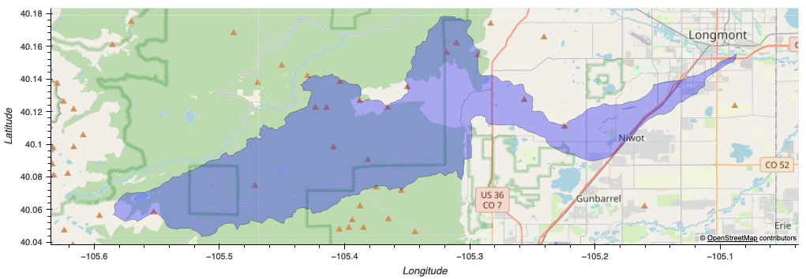

This is an immediate project area.

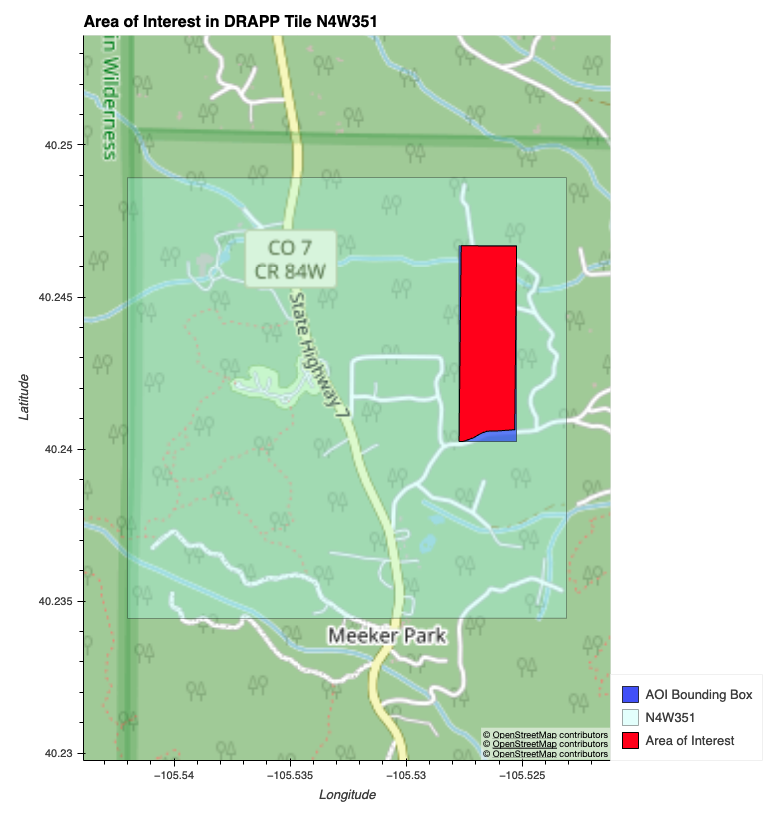

We are using the following data sources:
- [Aerial Data: "Denver Regional Aerial Photography Project (DRAPP)", Denver Regional Counsel of Governance, 2020.](https://data.drcog.org/dataset/denver-regional-aerial-photography-project-tiles-2020)
- [LiDAR Data: "DRCOG LIDAR QL2 INDEX IN CO SP NORTH 2020", Denver Regional Counsel of Governance.](https://data.drcog.org/dataset/lidar-ql2-index-in-co-sp-north-2020)

I have tried three different methods to identify openings in the forest:
1. **NDVI Thresholding**: Using the NDVI values (`open_spaces = ndvi >= 0.1`) to identify the openings in the forest. 
2. **K-means Clustering**: Using the k-means clustering algorithm (`k = 2`) to identify the openings in the forest.
3. **Segment Anything Model**: Using the Segment Anything model to identify the openings in the forest.

Here's the result of these methods in order:

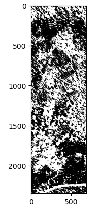
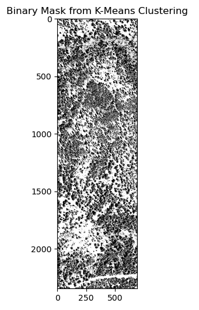
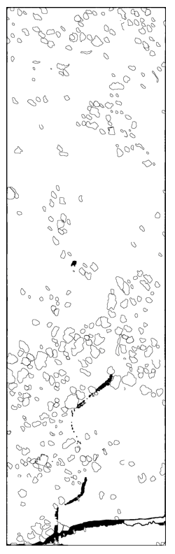

After creating the masking, I have converted the raster data to vector data to calculate the area of the openings in the forest. The projection is [EPSG:6428](http://epsg:6428/) with `US survey foot` as the unit. The area of the openings in the forest is calculated through `gdf.area / 43560` to convert the area from square feet to acres. Additionally, the openings are classified into different bins: 1/8 acre, 1/4 acre, 1/2 acre, and 1+ acres.

Here's the result of the area calculation:

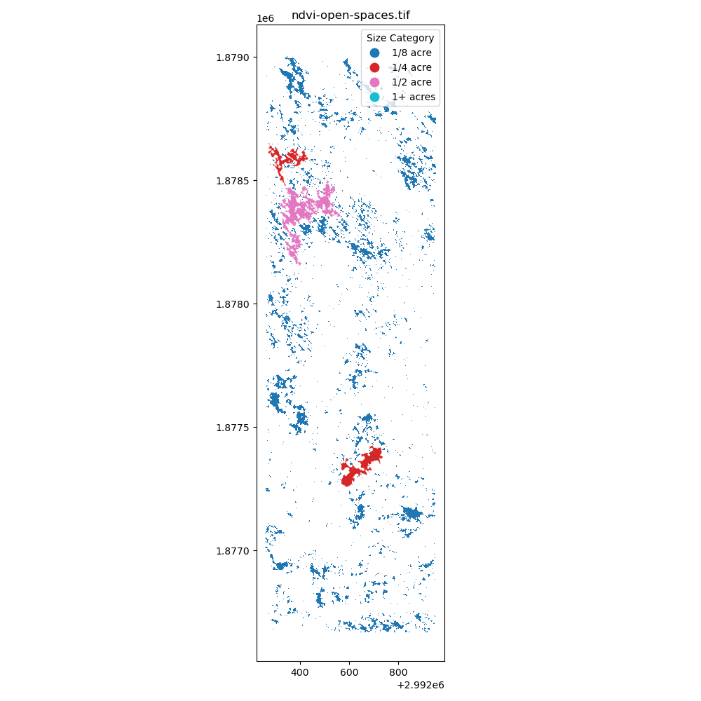
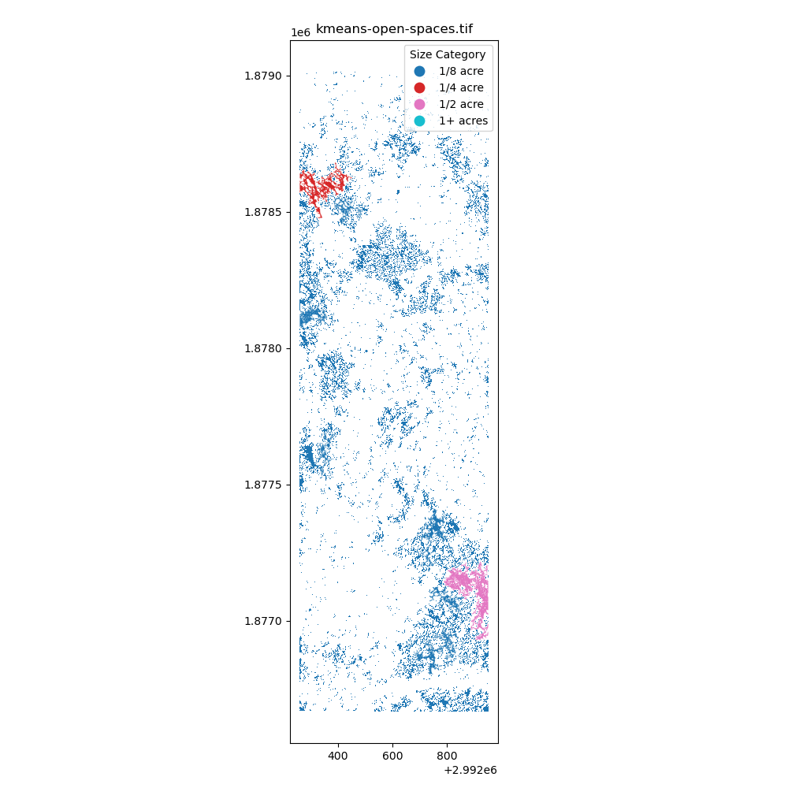
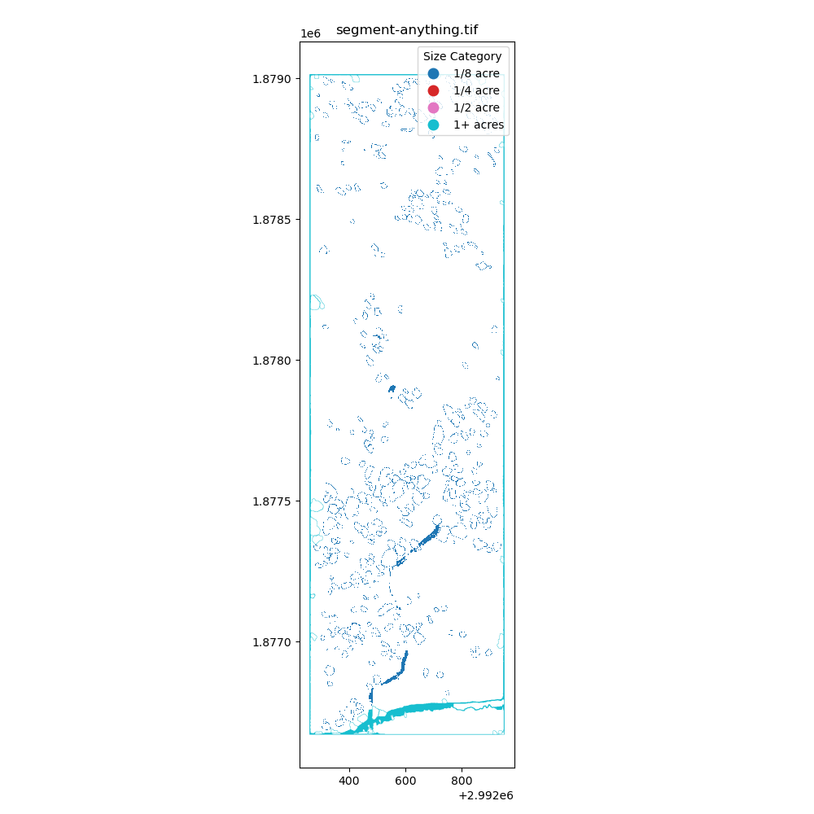

Immediately, I have learned that I need to find better ways to creating these polygons (potentially filling in the small holes) and I also need a better way to group by nearest neighbors to identify the openings in the forest. I am excited to learn more about the spatial data processing and how to apply it to the real world.

Separately, Peter has explored on how to process the LiDAR data to identify the openings in the forest. 

Here's the result of that:

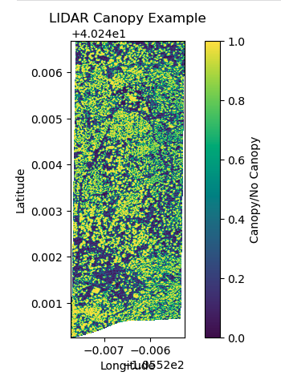

Overall, this is a great learning experience for me. I am looking forward to discuss with my team and my class on how to further hone my techniques and the develop a tool that has practical applications for the Watershed Center.

# Urban Greenspace
I have learned how to calculate NDVI statistics on the 1-m resolution aerial images from the National Agriculture Imagery Program (NAIP). As mentioned below, I have come across the Denver Regional Aerial Photography Project which offers even higher resolution aerial images (3-inch, 6-inch, 12-inch). I wanted to explore the NDVI statistics on these high-resolution images. I have chosen the city of Lafayette, Colorado, as my study site. 
[<sub><sup>Interactive HTML</sup></sub>](https://eggvoice.github.io/notebooks/lafayette_greenspace.html)
[<sub><sup>Source Code</sup></sub>](https://github.com/eggvoice/eggvoice.github.io/blob/main/notebooks/lafayette_greenspace.ipynb)

Here's the result of that:
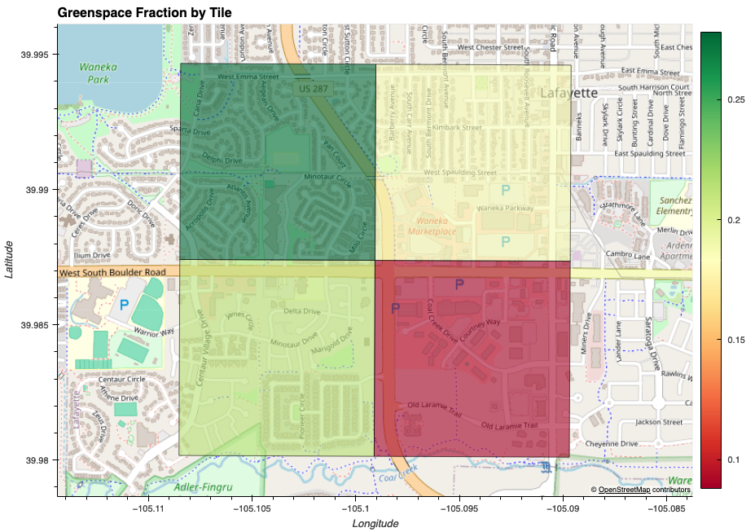

# Aerial Images Exploratory via Kmeans Clustering
I learned how to process HLSL30 data product using the k-means clustering algorithm. The format was provided in Cloud Optimized GeoTIFF (COG) format. I then came across a dataset of Denver regional aerial images. I wanted to practice the k-means clustering algorithm on these high-quality images. 
[<sub><sup>HTML</sup></sub>](https://eggvoice.github.io/notebooks/lafayette_clustering.html)
[<sub><sup>Source Code</sup></sub>](https://github.com/eggvoice/eggvoice.github.io/blob/main/notebooks/lafayette_clustering.ipynb)

The results were interesting. I have learned that **pixel interleaving** impacts how bands are stored differently in comparison to **band interleaving**. 

Here's the `gdalinfo` output to confirm the image structure:
```
% gdalinfo N2W134b.tif 
Driver: GTiff/GeoTIFF
Files: N2W134b.tif
Size is 10560, 10560
Coordinate System is:
PROJCRS["NAD83(2011) / Colorado Central (ftUS)",
    BASEGEOGCRS["NAD83(2011)",
        DATUM["NAD83 (National Spatial Reference System 2011)",
            ELLIPSOID["GRS 1980",6378137,298.257222101004,
                LENGTHUNIT["metre",1]]],
        PRIMEM["Greenwich",0,
            ANGLEUNIT["degree",0.0174532925199433]],
        ID["EPSG",6318]],
    CONVERSION["Lambert Conic Conformal (2SP)",
        METHOD["Lambert Conic Conformal (2SP)",
            ID["EPSG",9802]],
        PARAMETER["Latitude of false origin",37.8333333333333,
            ANGLEUNIT["degree",0.0174532925199433],
            ID["EPSG",8821]],
        PARAMETER["Longitude of false origin",-105.5,
            ANGLEUNIT["degree",0.0174532925199433],
            ID["EPSG",8822]],
        PARAMETER["Latitude of 1st standard parallel",39.75,
            ANGLEUNIT["degree",0.0174532925199433],
            ID["EPSG",8823]],
        PARAMETER["Latitude of 2nd standard parallel",38.45,
            ANGLEUNIT["degree",0.0174532925199433],
            ID["EPSG",8824]],
        PARAMETER["Easting at false origin",914401.828803658,
            LENGTHUNIT["metre",1],
            ID["EPSG",8826]],
        PARAMETER["Northing at false origin",304800.609601219,
            LENGTHUNIT["metre",1],
            ID["EPSG",8827]]],
    CS[Cartesian,2],
        AXIS["easting",east,
            ORDER[1],
            LENGTHUNIT["US survey foot",0.304800609601219]],
        AXIS["northing",north,
            ORDER[2],
            LENGTHUNIT["US survey foot",0.304800609601219]],
    ID["EPSG",6428]]
Data axis to CRS axis mapping: 1,2
Origin = (3112351.999799999874085,1784791.999800000106916)
Pixel Size = (0.250000000000000,-0.250000000000000)
Metadata:
  AREA_OR_POINT=Area
  TIFFTAG_DATETIME=2020:09:30 17:45:42
  TIFFTAG_RESOLUTIONUNIT=2 (pixels/inch)
  TIFFTAG_SOFTWARE=Adobe Photoshop CS5 Windows
  TIFFTAG_XRESOLUTION=72
  TIFFTAG_YRESOLUTION=72
Image Structure Metadata:
  INTERLEAVE=PIXEL
Corner Coordinates:
Upper Left  ( 3112352.000, 1784792.000) (105d 5'56.66"W, 39d59'14.59"N)
Lower Left  ( 3112352.000, 1782152.000) (105d 5'56.81"W, 39d58'48.50"N)
Upper Right ( 3114992.000, 1784792.000) (105d 5'22.74"W, 39d59'14.47"N)
Lower Right ( 3114992.000, 1782152.000) (105d 5'22.89"W, 39d58'48.38"N)
Center      ( 3113672.000, 1783472.000) (105d 5'39.77"W, 39d59' 1.49"N)
Band 1 Block=10560x1 Type=Byte, ColorInterp=Red
Band 2 Block=10560x1 Type=Byte, ColorInterp=Green
Band 3 Block=10560x1 Type=Byte, ColorInterp=Blue
Band 4 Block=10560x1 Type=Byte, ColorInterp=Undefined
```

Band interleaving stores each pixel band by band as illustrated by this [image](https://desktop.arcgis.com/en/arcmap/latest/manage-data/raster-and-images/GUID-8A660E6C-9CB7-49D0-B069-162DB1172150-web.gif).


Pixel interleaving stores pixels one band at a time as illustrated by this [image](https://desktop.arcgis.com/en/arcmap/latest/manage-data/raster-and-images/GUID-8A8A7AB1-3F96-4F1D-A2A3-75BE1F9CBEAE-web.gif).


(Credit: ArcGIS)

I picked a study site that's about 1 mile by 1 mile in size, near my home. 

Here's the RGB image before clustering:
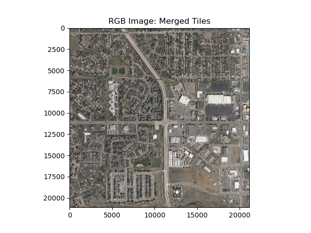

I have processed four tiles which took quite a bit of time (~20-30 minutes) on my MacBook Pro (M1). 
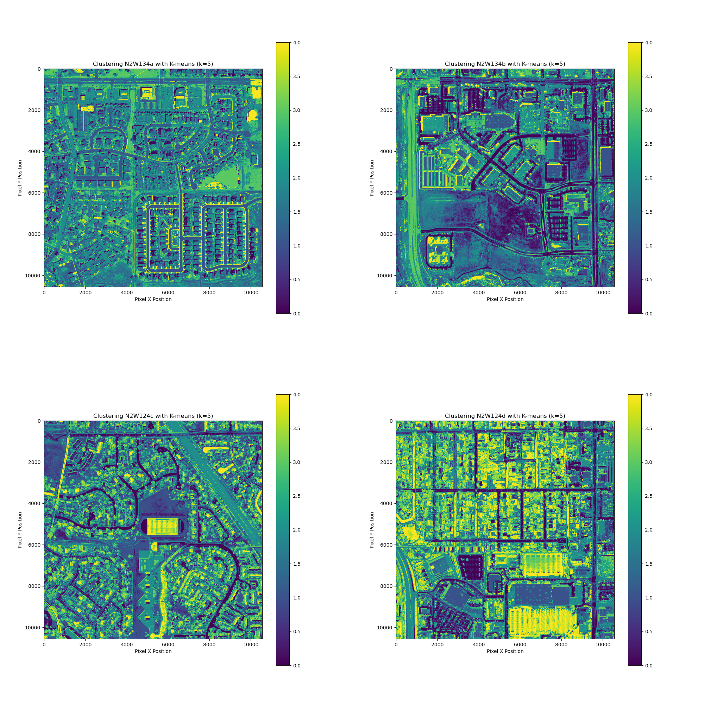

This seems like an excellent way to explore the data from the land cover perspective. I am excited to learn more about the land cover classifications and how to apply it to the real world.

# Multiple Data Layers
Multiple data layers related to soil, topography, and climate were handled in this project while trying to build a habitat suitability model for Sorghasstrum Nutans.
[<sub><sup>Interactive HTML</sup></sub>](https://eggvoice.github.io/notebooks/sorghastrum-nutans.html)
[<sub><sup>Source Code</sup></sub>](https://github.com/eggvoice/eggvoice.github.io/blob/main/notebooks/sorghastrum-nutans.ipynb)

### Snippets from this project...

#### Fuzzy Logic Model (Suitability)
These parameters haven't gone through any rigirous selection process.

To demonstrate the ability to manipulate and harmonize DataArray objects, the following were defined:

* Elevation (Low or Moderate): A trapezoidal membership function that covers elevations from 0 to 2000 meters
* Slightly Acidic/Neutral Soil: Gaussian membership function centered at a pH of 6.5 with a spread of 1.
* Well-drained soil is inferred indirectly from having moderate to high precipitation but while the specific humidity isn't high
    * Moderate or High Precipitatoin: Gaussian membership function centered at 35 mm with a spread of 10 mm.
    * Moderate Humidity: Gaussian membership function centered at 0.00500 kg/kg with a spread of 0.0005.

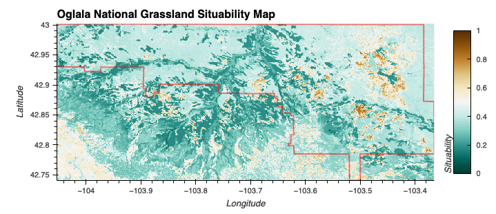


#### Elevation
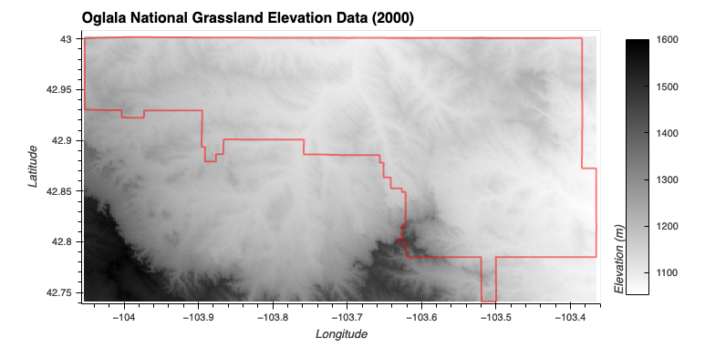

#### Elevation Aspect
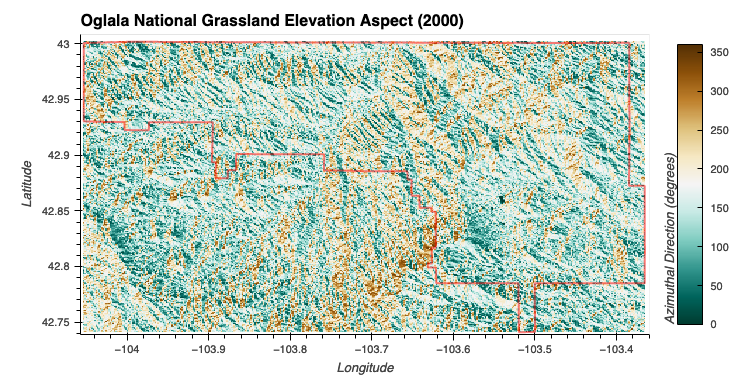

#### Soil pH
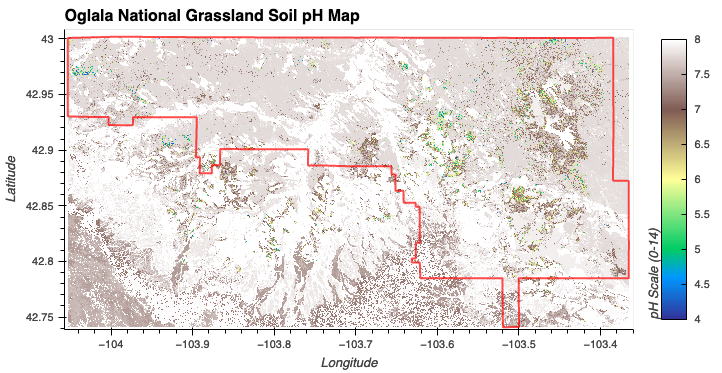

#### Precipitation
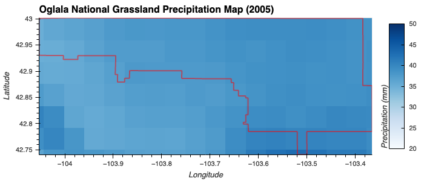

#### Specific Humidity
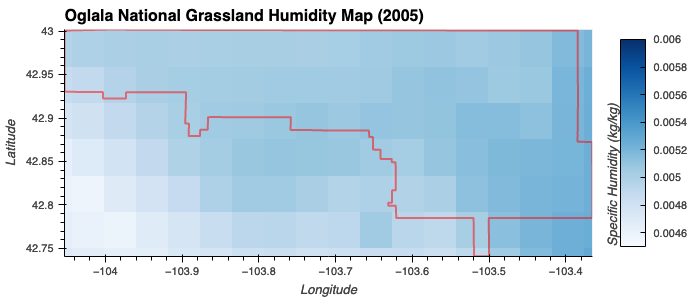

#### Next Steps
Look into Vapor Pressure Deficit over Specific Humidity, since it is more directly related to evaporative stress.

#### Data Citation
* United States Forest Service (USFS). (2023). U.S. National Grassland Shapefiles [Data set]. USFS Enterprise Data Warehouse. Accessed 2023-12-18 from [https://data.fs.usda.gov/geodata/edw/edw_resources/shp/S_USA.NationalGrassland.zip](https://data.fs.usda.gov/geodata/edw/edw_resources/shp/S_USA.NationalGrassland.zip)
* NASA JPL (2013). NASA Shuttle Radar Topography Mission Global 1 arc second [Data set]. NASA EOSDIS Land Processes Distributed Active Archive Center. Accessed 2023-12-18 from [https://doi.org/10.5067/MEaSUREs/SRTM/SRTMGL1.003](https://doi.org/10.5067/MEaSUREs/SRTM/SRTMGL1.003)
* Duke University. (2019). POLARIS Soil Properties v1.0: pH Mean 60-100 cm Depth [Data set]. Duke University Hydrology Laboratory. Accessed 2023-12-18 from [http://hydrology.cee.duke.edu/POLARIS/PROPERTIES/v1.0/ph/mean/60_100/](http://hydrology.cee.duke.edu/POLARIS/PROPERTIES/v1.0/ph/mean/60_100/)
* Northwest Knowledge Network. (2023). MACAv2 Metdata Precipitation Data - CCSM4 Historical 1950-2005 [Data set]. Northwest Knowledge Network. Accessed 2023-12-18 from [http://thredds.northwestknowledge.net:8080/thredds/ncss/agg_macav2metdata_pr_CCSM4_r6i1p1_historical_1950_2005_CONUS_monthly.nc?var=precipitation&disableProjSubset=on&horizStride=1&time_start=2005-01-15T00%3A00%3A00Z&time_end=2005-12-15T00%3A00%3A00Z&timeStride=1&addLatLon=true&accept=netcdf](http://thredds.northwestknowledge.net:8080/thredds/ncss/agg_macav2metdata_pr_CCSM4_r6i1p1_historical_1950_2005_CONUS_monthly.nc?var=precipitation&disableProjSubset=on&horizStride=1&time_start=2005-01-15T00%3A00%3A00Z&time_end=2005-12-15T00%3A00%3A00Z&timeStride=1&addLatLon=true&accept=netcdf)
* Northwest Knowledge Network. (2023). MACAv2 Metdata Specific Humidity Data - CCSM4 Historical 1950-2005 [Data set]. Northwest Knowledge Network. Accessed 2023-12-18 from [http://thredds.northwestknowledge.net:8080/thredds/ncss/agg_macav2metdata_huss_CCSM4_r6i1p1_historical_1950_2005_CONUS_monthly.nc?var=specific_humidity&disableLLSubset=on&disableProjSubset=on&horizStride=1&time_start=2005-01-15T00%3A00%3A00Z&time_end=2005-12-15T00%3A00%3A00Z&timeStride=1&accept=netcdf](http://thredds.northwestknowledge.net:8080/thredds/ncss/agg_macav2metdata_huss_CCSM4_r6i1p1_historical_1950_2005_CONUS_monthly.nc?var=specific_humidity&disableLLSubset=on&disableProjSubset=on&horizStride=1&time_start=2005-01-15T00%3A00%3A00Z&time_end=2005-12-15T00%3A00%3A00Z&timeStride=1&accept=netcdf)

# 2022 NDVI for Popular Neighborhoods in San Francisco
According to USDA -
>In general, NDVI values range from -1.0 to 1.0, with negative values indicating clouds and water, positive values near zero indicating bare soil, and higher positive values of NDVI ranging from sparse vegetation (0.1 - 0.5) to dense green vegetation (0.6 and above).

In this exercise, 2022 NDVI statistics were calculated for three popular neighborhoods (Marina, Mission, North Beach) in San Francisco to assess the greenness and overall suitability for living in each neighborhood. Presidio was added as a benchmark. Nothing conclusive, but it's fun to just look from this perspective!
[<sub><sup>Interactive HTML</sup></sub>](https://eggvoice.github.io/notebooks/san-francisco-multispectral.html)
[<sub><sup>Source Code</sup></sub>](https://github.com/eggvoice/eggvoice.github.io/blob/main/notebooks/san-francisco-multispectral.ipynb)\
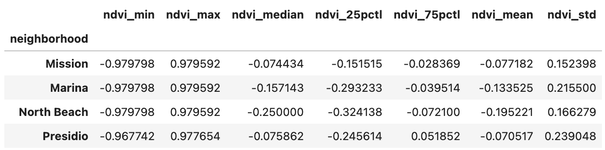\
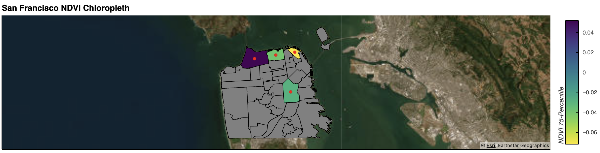
##### Data Source:
[San Francisco Open Data](https://data.sfgov.org/Geographic-Locations-and-Boundaries/SF-Find-Neighborhoods/pty2-tcw4)\
[San Francisco 2022 NAIP](https://naip-usdaonline.hub.arcgis.com/)

# Fire Density in California Watersheds
Increasing both numbers and sizes of wildfire in California Watersheds.\
In the case of Sacremento, fire size is increasing in recent times.
[<sub><sup>Interactive HTML</sup></sub>](https://eggvoice.github.io/notebooks/wildfire-fire-density.html)
[<sub><sup>Source Code</sup></sub>](https://github.com/eggvoice/eggvoice.github.io/blob/main/notebooks/wildfire-fire-density.ipynb)\
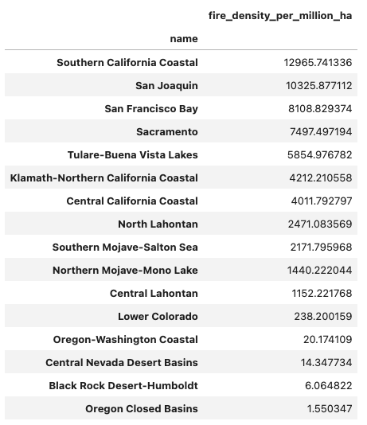
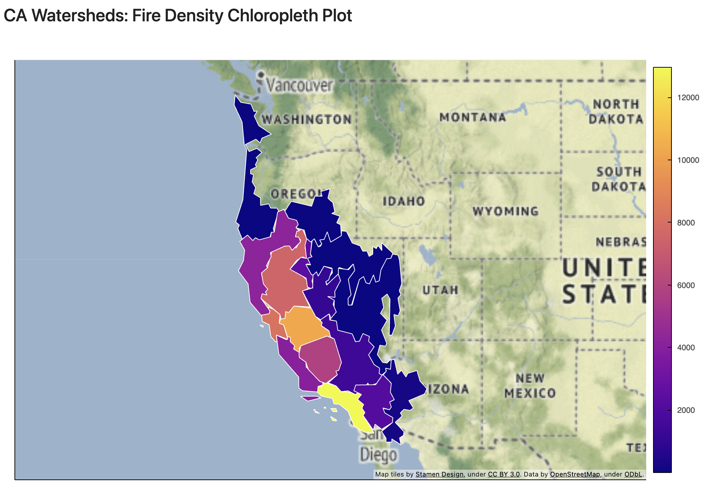
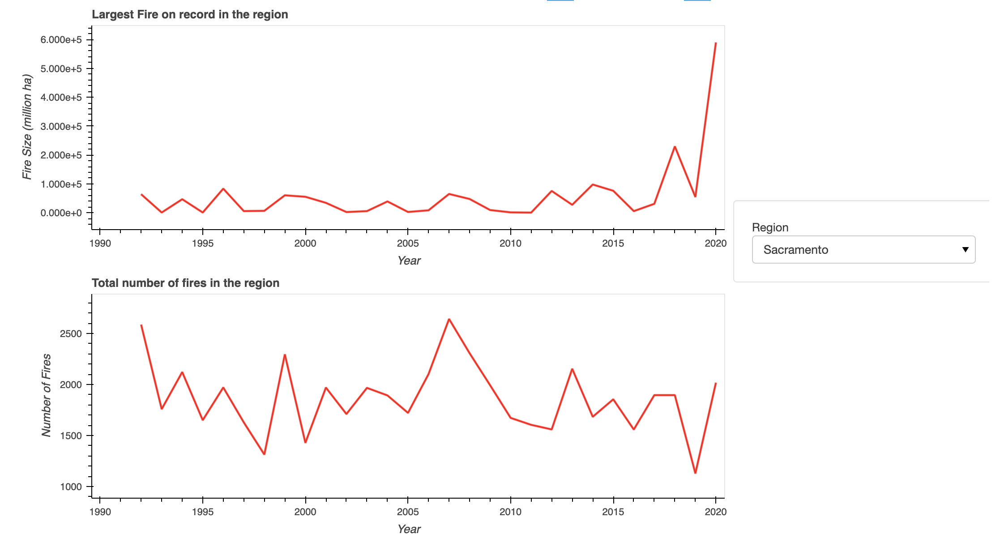

# Vegetation Recovery after the Caldor Fire
Plotting dNDVI before and after the Caldor Fire suggests recovery in vegetation after two years.\
[<sub><sup>Interactive HTML</sup></sub>](https://eggvoice.github.io/notebooks/modis-ndvi-caldor-fire.html)
[<sub><sup>Source Code</sup></sub>](https://github.com/eggvoice/eggvoice.github.io/blob/main/notebooks/modis-ndvi-caldor-fire.ipynb)\
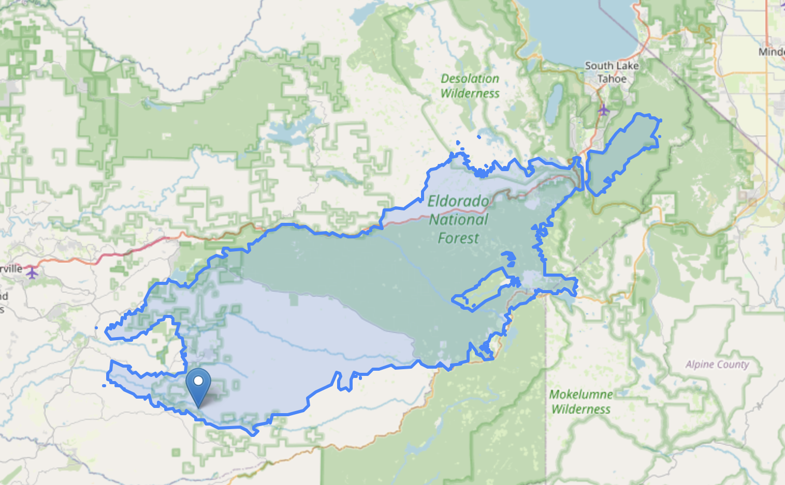
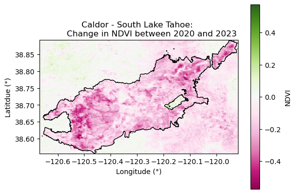
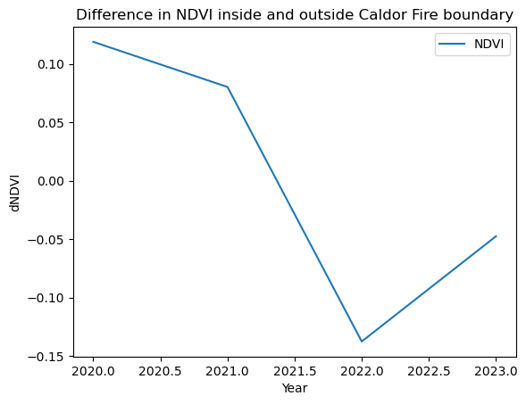

##### Python Libraries: 
[`earthpy`](https://github.com/earthlab/earthpy), [`folium`](https://github.com/python-visualization/folium), [`geopandas`](https://github.com/geopandas/geopandas), [`matplotlib`](https://github.com/matplotlib/matplotlib), [`pandas`](https://github.com/pandas-dev/pandas), [`rioxarray`](https://github.com/corteva/rioxarray), [`xarray`](https://github.com/pydata/xarray)

##### Data Source:
* [WFIGS Interagency Perimeters > Filter (poly_IncidentName=Caldor)](https://data-nifc.opendata.arcgis.com/datasets/nifc::wfigs-interagency-fire-perimeters/api)
* NDVI dataset at https://appeears.earthdatacloud.nasa.gov/task/area \
(NASA Earthdata account required)
  * Check out [the list of APPEEARS datasets](https://appeears.earthdatacloud.nasa.gov/products)
 
##### Citation: 
* National Interagency Fire Center [The NIFC Org]. (2021). *Wildland Fire Interagency Geospatial Services (WFIGS) Interagency Fire Perimeters.* National Interagency Fire Center ArcGIS Online Organization. Accessed 2023-10-01 from https://data-nifc.opendata.arcgis.com/datasets/nifc::wfigs-interagency-fire-perimeters/api
* Didan, K. (2021). *MODIS/Aqua Vegetation Indices 16-Day L3 Global 250m SIN Grid V061* [250m 16 days NDVI]. NASA EOSDIS Land Processes Distributed Active Archive Center. Accessed 2023-10-01 from https://doi.org/10.5067/MODIS/MYD13Q1.061

# Flood Frequency Analysis of Penn State
Plotting water time series data (1985-2022) suggests 2004 being the worst flooding year (a 38-year flood event) in the Penn State region in recent times.
[<sub><sup>Interactive HTML</sup></sub>](https://eggvoice.github.io/notebooks/usgs-nwis-time-series-flood-analysis.html)
[<sub><sup>Source Code</sup></sub>](https://github.com/eggvoice/eggvoice.github.io/blob/main/notebooks/usgs-nwis-time-series-flood-analysis.ipynb)
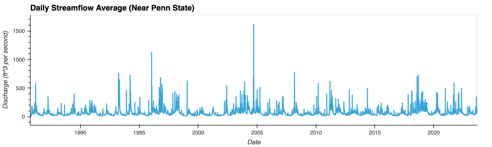
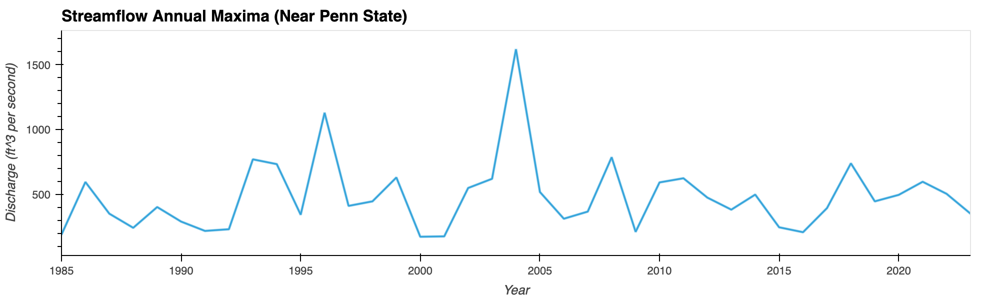
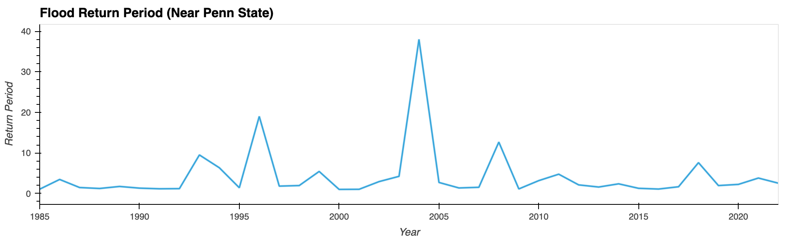

##### Python Libraries: 
[`folium`](https://github.com/python-visualization/folium), [`pandas`](https://github.com/pandas-dev/pandas), [`hvplot`](https://github.com/holoviz/hvplot), [`requests`](https://github.com/psf/requests)

##### Data Source:
[USGS National Water Dashboard > State College, PA > USGS 01546400 (Surface Water, Stream) > Data (Daily Data)](https://waterdata.usgs.gov/nwis/inventory?site_no=01546400)

##### Citation: 
U.S. Geological Survey, 2023, National Water Information System data available on the World Wide Web (USGS Water Data for the Nation), accessed [September 19, 2023], at URL [http://waterdata.usgs.gov/nwis/](http://waterdata.usgs.gov/nwis/)

##### Fun Read:
* [Stationarity is Undead - Risk communication under nonstationarity: a farewell to return period?](https://www.sciencedirect.com/science/article/pii/S0309170815000020?ref=pdf_download&fr=RR-2&rr=8096f5b969a41f3d#s0020)
* [Stationarity is Dead](https://www.law.berkeley.edu/files/CLEE/Milly_2008_Science_StationarityIsDead.pdf)
* ["100-year floods can happen 2 years in a row"](https://www.usgs.gov/special-topics/water-science-school/science/100-year-flood)

# San Francisco Average Temperatures
A upward trend over the observed years (1946-2022)
[<sub><sup>Interactive HTML</sup></sub>](https://eggvoice.github.io/notebooks/ncei_tavg_san_francisco.html)
[<sub><sup>Source Code</sup></sub>](https://github.com/eggvoice/eggvoice.github.io/blob/main/notebooks/ncei_tavg_san_francisco.ipynb)
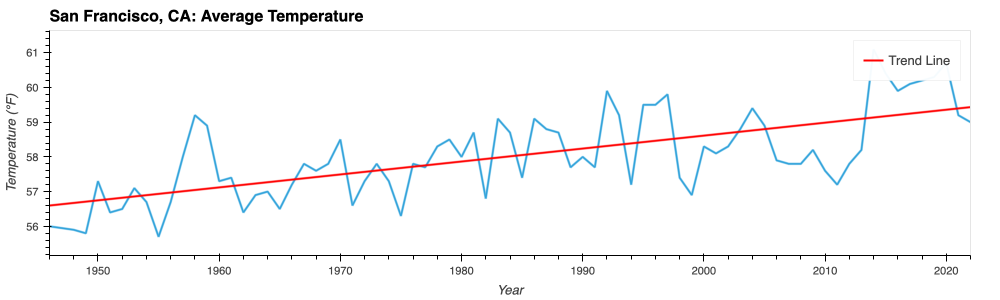

##### Python Libraries: 
[`pandas`](https://github.com/pandas-dev/pandas), [`hvplot`](https://github.com/holoviz/hvplot), [`holoviews`](https://github.com/holoviz/holoviews), [`numpy`](https://github.com/numpy/numpy)

##### Data Source:
[Climate at a Glance > City > Time Series > San Francisco (Average Temperature, 12-Month, December)](https://www.ncei.noaa.gov/access/monitoring/climate-at-a-glance/city/time-series/USW00023174/tavg/12/12/1945-2022.csv)

##### Citation: 
NOAA National Centers for Environmental information, Climate at a Glance: City Time Series, published August 2023, retrieved on September 7, 2023 from [https://www.ncei.noaa.gov/access/monitoring/climate-at-a-glance/city/time-series](https://www.ncei.noaa.gov/access/monitoring/climate-at-a-glance/city/time-series)

##### Fun Fact:
* Climate at a Glance is created from [NOAAGlobalTemp](https://www.ncei.noaa.gov/products/land-based-station/noaa-global-temp) dataset which includes land surface air (LSAT) temperature from the [Global Historical Climatology Network monthly (GHCNm)](https://www.ncei.noaa.gov/products/land-based-station/global-historical-climatology-network-monthly) and sea surface temperature (SST) from [Extended Reconstructed SST (ERSST)](https://www.ncei.noaa.gov/products/extended-reconstructed-sst).
* According to this [paper](https://journals.ametsoc.org/view/journals/clim/33/4/jcli-d-19-0395.1.xml), \"LSAT has been measured by meteorological stations since the late 1600s, and SST has been measured by commercial ships since the early 1700s and by moored and drifting buoy floats since the 1970s.\"
* There is a weather station in San Francisco Downtown.\
Topography Description: `IN CENTRAL SAN FRANCISCO ON MINT HILL (ON SITE U.S. MINT) AT THE CORNER OF HERMANN AND BUCHANAN). DOWNTOWN AREA NE THROUGH E.` from [NCDC](https://www.ncdc.noaa.gov/cdo-web/datasets/GHCND/stations/GHCND:USW00023272/detail).\
Latitude/Longitude: `37.7705°, -122.4269°` (Plug that into Google Maps!)

***

# About Me:
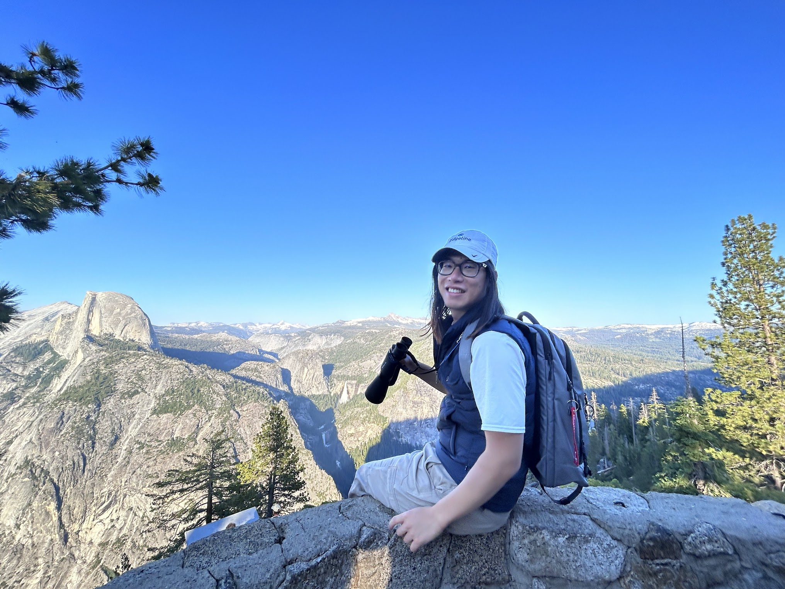
> [We came all this way to explore the moon, and the most important thing is that we discovered the Earth.](https://www.nasa.gov/pdf/323298main_CelebrateApolloEarthRise.pdf)

<sup>William Anders, Apollo 8 Astronaut</sup>

Hey there! It's Ed. I am a technical consultant by trade. Having witnessed the [Orange Skies Day](https://en.wikipedia.org/wiki/Orange_Skies_Day) in 2020 when I was living in [Emeryville](https://en.wikipedia.org/wiki/Emeryville,_California) (San Francisco East Bay), I want to find ways to equip ourselves to respond and adapt to this new world we live in. While having a general interest in the space industry, I didn’t always have a strong interest in earth data science until my recent experience at [GNSS+R 2023](https://igs.org/event/ieee-gnssr-2023/) and [ESIP 2023 Summer Meeting](https://www.esipfed.org/meetings). Space up, space down, so to speak. Right now, I am learning geoprocessing with Python at CU Boulder. I am excited to find out where I fit and how I can contribute with my skills. I am the happiest with my little cup of espresso. Open to connect!

**Likes**\
Expresso :coffee:\
Board games :game_die:\
Books :books:

**Interests**\
Climbing\
Python\
California's Geology

**Education**\
MSc Space Studies, [International Space University](https://www.isunet.edu/) (2021)\
BS Information Systems Design and Development, [Penn State](https://www.psu.edu/) (2015)

**Find Me Online**\
Blog: [eggvoice.com](https://eggvoice.com)\
GitHub: [eggvoice](https://github.com/eggvoice)\
Twitter: [myeggvoice](https://twitter.com/myeggvoice)\
LinkedIn: [Edward Chan](https://www.linkedin.com/in/edward6chan/)
